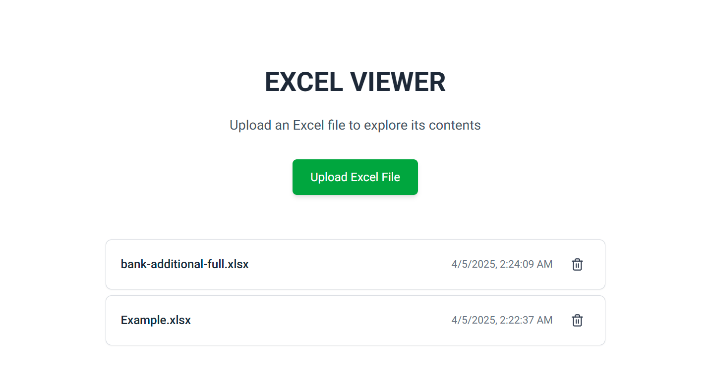

# Excel Viewer

Excel Viewer is a simple web application for uploading, viewing, and interacting with Excel files.

It allows users to:

- Upload Excel files

- View uploaded files in a table format

- Sort, filter, and paginate the table

- Manage uploaded files (list and delete)

The app is built with a modern **React** frontend and a **Node.js** + **MongoDB** backend.

You can run the application using [docker-compose.yml](docker-compose.yml).

## Quick Start

```sh
docker-compose up --build
```

Open your browser at http://localhost:5173

## Development

To run the backend locally without Docker, make sure you have a MongoDB instance running.  
Update your `.env` file with the correct connection settings before starting the server.

## Project Structure

[frontend/ — the React + TypeScript client](./frontend/README.md)  
[backend/ — the Express.js + MongoDB server](./backend/README.md)


